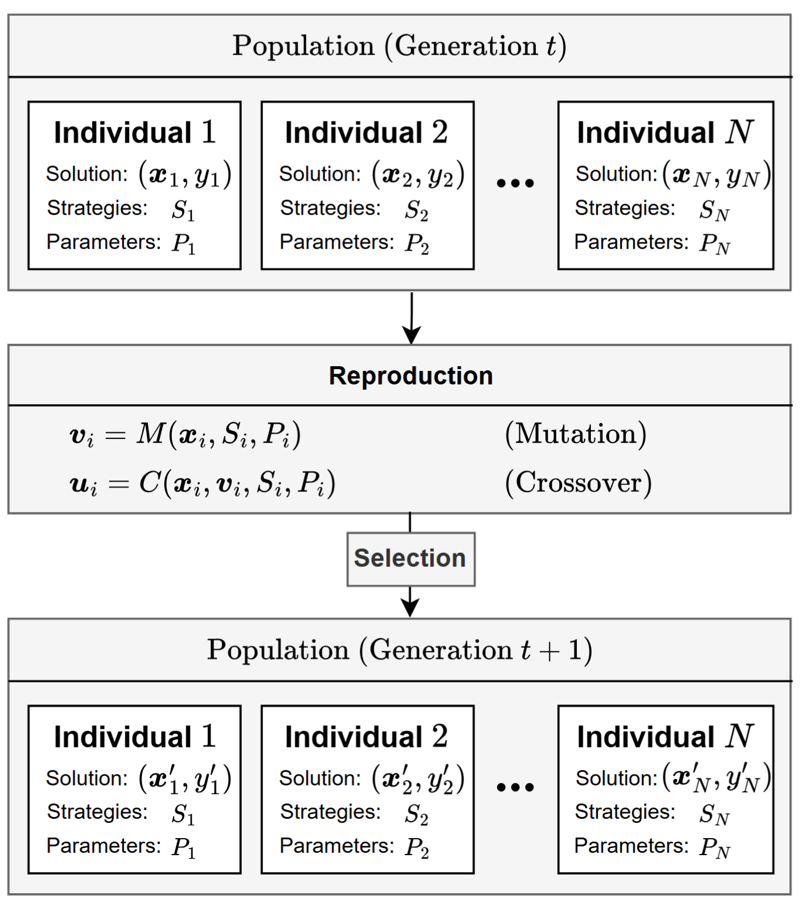

<h1 align="center">
  <a href="https://github.com/EMI-Group/evox">
  <picture>
    <source media="(prefers-color-scheme: dark)" srcset="./assets/evox_logo_dark.png">
    <source media="(prefers-color-scheme: light)" srcset="./assets/evox_logo_light.png">
      
  </picture>
  </a>
  <br>
</h1>


<h2 align="center">
  <p>🌟 Unleashing the Potential of Differential Evolution through Individual-Level Strategy Diversity 🌟</p>

[//]: # (  <a href="https://arxiv.org/abs/2502.10470">)

[//]: # (    )

[//]: # (  </a>)
</h2>

iStratDE is a minimalist yet powerful Differential Evolution (DE) variant that achieves superior performance through individual-level strategy diversity. Unlike traditional adaptive DEs that adjust strategies at the population level via feedback, iStratDE assigns mutation and crossover strategies—along with their control parameters—randomly and independently to each individual at initialization. These configurations remain fixed, cultivating persistent behavioral heterogeneity that effectively mitigates premature convergence, especially in large-population and high-dimensional settings.


Designed with a communication-free architecture, iStratDE possesses intrinsic concurrency that maps naturally to GPU computing, enabling massive parallelism without synchronization bottlenecks. iStratDE is fully integrated into the <a href="https://github.com/EMI-Group/evox">EvoX</a> framework.
> **Backend Support**:
> 
> iStratDE supports both **JAX** and **PyTorch** backends.
>
> - **PyTorch Backend:**
>   - Supports **Brax-based robotic control tasks** (requires additional installation of JAX for the environment simulation).
>   - For optimal performance, we strongly recommend using **EvoX 1.1.1** or higher version with a CUDA-enabled PyTorch environment.
>
> - **JAX Backend:**
>   - Fully supported and recommended for users seeking maximum throughput with CUDA-enabled JAX.
>   - Offers superior execution efficiency, generally providing approximately **2x the speed** of the PyTorch backend.

To replicate the experimental results on **CEC2022 benchmarks** and **Brax robotic tasks** exactly as presented in the paper, you may utilize JAX backend with a CUDA-enabled installation.

## Features

- **Individual-Level Strategy Diversity** 🧬: Assigns unique mutation and crossover strategies to each individual at initialization, cultivating persistent behavioral heterogeneity.
- **Minimalist & Non-Adaptive** 🍃: Achieves robust performance through fixed structural diversity, eliminating the need for complex feedback loops, archives, or dynamic parameter tuning.
- **Intrinsic Concurrency** ⚡: Features a communication-free design that avoids synchronization bottlenecks, mapping naturally to modern GPU architectures for massive parallelism.
- **Implicit Elitism & Asynchronous Convergence** 📈: Leverages elite individuals to steer the search while allowing others to explore along diverse temporal trajectories, effectively mitigating premature convergence.
- **Exceptional Scalability** 🚀: Explicitly designed to exploit large-scale populations, showing steady performance gains as the population size increases.
- **Broad Applicability** 🤖: Demonstrates state-of-the-art results across various benchmarks, including CEC2022, and high-dimensional robotic control tasks within the Brax framework.
- **Multi-Backend Support** 🔥: Native support for both JAX and PyTorch backends, fully integrated with the EvoX framework for seamless hardware acceleration.
## RL Tasks Visualization

Using the iStratDE algorithm to solve RL tasks.

The following animations show the behaviors in Brax environments:

<table width="81%">
  <tr>
    <td width="27%">
      
    </td>
    <td width="27%">
      
    </td>
    <td width="27%">
      
    </td>
  </tr>
  <tr>
    <td align="center">
      Hopper
    </td>
    <td align="center">
      Swimmer
    </td>
    <td align="center">
      Reacher
    </td>
  </tr>
</table>

- **Hopper**: Aiming for maximum speed and jumping height.  
- **Swimmer**: Enhancing movement efficiency in fluid environments.  
- **Reacher**: Moving the fingertip to a random target.

## Requirements

Depending on which backend you plan to use (JAX or PyTorch), you should install the proper libraries and GPU dependencies:

- **Common**:
  - `evox >= 1.1.1` (PyTorch support)
  - `brax == 0.12.1` (optional, if you want to run Brax RL problems)
  
- **JAX**-based version:
  - `jax == 0.4.33`
  - `jaxlib == 0.4.33`

- **PyTorch**-based version:
  - `torch` (GPU version recommended, e.g. `torch>=2.5.0`)
  - `torchvision`, `torchaudio`

## Installation
### Best Practice:
```bash
  pip install \
  "jax[cuda12]==0.4.33" \
  "brax==0.12.1" \
  "mujoco==3.2.7" \
  "flax==0.8.5" \
  "optax==0.2.3" \
  "orbax-checkpoint==0.6.1" \
  "numpy==1.26.4" \
  -f https://storage.googleapis.com/jax-releases/jax_cuda_releases.html
```
```bash
  pip install torch --index-url https://download.pytorch.org/whl/cu121
```
```bash
  pip install git+https://github.com/EMI-Group/evox.git@v1.1.1
```
### Environment Verification
Once the installation is complete, you can verify your library versions and GPU availability by running the provided environment check script:
```bash
python show_env.py
```
This script will confirm if your hardware is correctly recognized, ensuring iStratDE can leverage its communication-free design for fully parallel updates.

## Components

### Individual-Level Strategy Pool
iStratDE attains behavioral richness by assigning a unique, immutable strategy profile to each individual at initialization. 

- **Combinatorial Diversity**: A pool of 192 distinct configurations is formed by combining various base vectors, differential vector counts, and crossover schemes.
- **Fixed Assignments**: Strategies and control parameters (F, CR) are assigned once and remain fixed throughout the evolution, ensuring persistent structural diversity across the population.


### GPU Acceleration
iStratDE is fully integrated with the EvoX framework. By utilizing a communication-free design, it achieves high hardware utilization on both JAX and PyTorch backends, making it possible to scale to massive populations for complex, high-dimensional black-box optimization.
## Examples

### Global Optimization Benchmark Functions

```python
import jax.numpy as jnp
import jax
from tqdm import tqdm
from istratde.util import StdSOMonitor, StdWorkflow
from istratde.problems.jax import Sphere
from istratde.algorithms.jax import IStratDE

# Problem settings
D = 10
key_start = 42

# Algorithm settings
POP_SIZE = 100000
STEPS = 1000

# Define search space
lb = jnp.full((D,), -100.0)
ub = jnp.full((D,), 100.0)

# Initialize iStratDE
algorithm = IStratDE(
    lb=lb,
    ub=ub,
    pop_size=POP_SIZE,
)

# Problem to solve
problem = Sphere()

# Monitor for tracking best fitness
monitor = StdSOMonitor(record_fit_history=False)

# Initialize standard workflow
workflow = StdWorkflow(
    algorithm=algorithm,
    problem=problem,
    monitor=monitor,
)

# Initialize state
key = jax.random.PRNGKey(key_start)
state = workflow.init(key)

# Main optimization loop
for step in tqdm(range(STEPS), desc="Running iStratDE"):
    state = workflow.step(state)

# Print result
print(f"Best fitness: {monitor.get_best_fitness()}")
```
> If you want to use the PyTorch backend, please refer to the PyTorch examples under `examples/pytorch/example.py` in this repository.

### CEC Benchmark Problems

iStratDE supports benchmark suites such as CEC2022. Here’s an example (JAX-based) for the CEC2022 test suite:

```python
import jax.numpy as jnp
import jax
from tqdm import tqdm
from istratde.util import StdSOMonitor, StdWorkflow
from istratde.problems.jax import CEC2022TestSuit
from istratde.algorithms.jax import IStratDE

# Problem setting
D = 10  # Dimension (CEC2022 supports 10D, 20D)
FUNC_LIST = jnp.arange(12) + 1  # Functions 1 to 12
key_start = 42

# IStratDE algorithm settings
POP_SIZE = 100000  # Large population size to leverage JAX parallelism
STEPS = 5000       # Total generations

# Define search space for CEC2022
lb = jnp.full((D,), -100.0)
ub = jnp.full((D,), 100.0)

for func_num in FUNC_LIST:
    # 1. Create specific CEC2022 problem instance
    base_problem = CEC2022TestSuit.create(int(func_num))
    print(f"Testing Problem: CEC2022 F{int(func_num)}")

    # 2. Initialize IStratDE
    algorithm = IStratDE(
        lb=lb,
        ub=ub,
        pop_size=POP_SIZE,
    )

    # 3. Initialize Monitor
    monitor = StdSOMonitor(record_fit_history=False)

    # 4. Initialize Workflow directly with the problem
    workflow = StdWorkflow(
        algorithm=algorithm,
        problem=base_problem,
        monitor=monitor,
    )

    # 5. Initialize State
    key = jax.random.PRNGKey(key_start)
    state = workflow.init(key)
    
    # 6. Main Optimization Loop
    for i in tqdm(range(STEPS), desc=f"F{int(func_num)} Progress"):
        state = workflow.step(state)

    # 7. Final Results
    print(f"F{int(func_num)} Best_fitness: {monitor.get_best_fitness()}")
    print("-" * 30)
```
> If you want to use the PyTorch backend, please refer to the PyTorch examples under `examples/pytorch/example_cec2022.py` in this repository.
> 
### Robotics Control (Evolutionary Reinforcement Learning)

iStratDE is highly effective for real-world applications such as robotic control through evolutionary reinforcement learning (EvoRL). To run these robotic policy optimization examples, ensure you have installed a CUDA-enabled JAX environment along with `brax==0.12.1`.

```python
from tqdm import tqdm
from jax import random
from flax import linen as nn
import jax.numpy as jnp
import jax
import istratde.problems
from istratde.algorithms.jax import IStratDE
from istratde.util import StdSOMonitor, StdWorkflow, TreeAndVector

# 1. Define Policy Network (Swimmer: 8 obs -> 2 actions)
class SwimmerPolicy(nn.Module):
    @nn.compact
    def __call__(self, x):
        x = x.astype(jnp.float32)
        x = x.reshape(-1)
        x = nn.Dense(32)(x)
        x = nn.tanh(x)
        x = nn.Dense(32)(x)
        x = nn.tanh(x)
        x = nn.Dense(2)(x)
        x = nn.tanh(x)
        return x

# 2. Setup Parameter Adapter (Flat Vector <-> PyTree)
key = jax.random.PRNGKey(42)
model = SwimmerPolicy()
weights = model.init(random.PRNGKey(42), jnp.zeros((8,))) # Initialize weights
adapter = TreeAndVector(weights)
vector_form_weights = adapter.to_vector(weights)
D = vector_form_weights.shape[0] # Total weight dimension

# 3. Initialize IStratDE Algorithm
steps = 100
pop_size = 10000
lb = jnp.full((D,), -10.0)
ub = jnp.full((D,), 10.0)

algorithm = IStratDE(
    lb=lb,
    ub=ub,
    pop_size=pop_size,
)

# 4. Setup Problem (Brax Swimmer)
problem = istratde.problems.jax.Brax(
    env_name="swimmer",
    policy=jax.jit(model.apply),
    cap_episode=500,
)

# 5. Initialize Workflow
monitor = StdSOMonitor(record_fit_history=False)

workflow = StdWorkflow(
    algorithm=algorithm,
    problem=problem,
    monitor=monitor,
    pop_transform=adapter.batched_to_tree, # Convert population back to tree structure
    opt_direction='max', # Maximize reward
)

# 6. Run Loop
key, _ = jax.random.split(key)
state = workflow.init(key)

for i in tqdm(range(steps), desc="Swimmer Evolution"):
    state = workflow.step(state)
    print(f"fitness: {monitor.get_best_fitness()}")

print(f"Best fitness: {monitor.get_best_fitness()}")
```
> If you want to use the PyTorch backend, please refer to the PyTorch examples under `examples/pytorch/example_brax.py` in this repository.


## Community & Support

- Engage in discussions and share your experiences on [GitHub Discussion Board](https://github.com/EMI-Group/evox/discussions).
- Join our QQ group (ID: 297969717).

## Citing iStratDE
```
@ARTICLE{istratde2026,
  author={Feng, Chenchen and Chen, Minyang and Li, Zhuozhao and Cheng, Ran},
  journal={IEEE Transactions on Evolutionary Computation}, 
  title={Unleashing the Potential of Differential Evolution through Individual-Level Strategy Diversity}, 
  year={2026},
  pages={1-1},
  keywords={Vectors;Convergence;Optimization;Arithmetic;Tuning;Synchronization;Evolutionary computation;Concurrent computing;Computer science;Benchmark testing;Differential Evolution;Population Diversity;GPU Computing},
  doi={10.1109/TEVC.2026.3659799}}
```
